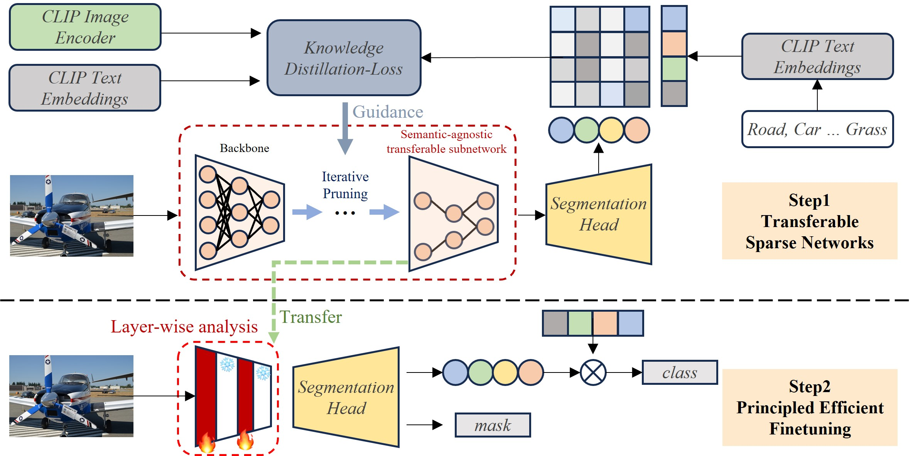

# OpenTrans
This repo contains the code for our paper [**Transferable and Principled Efficiency for Open-Vocabulary Segmentation**]

  

 

## Abstract
Recent success of pre-trained foundation vision-language models makes Open-Vocabulary Segmentation (OVS) possible. Despite the promising performance, this approach introduces heavy computational overheads for two challenges: 1) large model sizes of the backbone; 2) expensive costs during the fine-tuning. These challenges hinder this OVS strategy from being widely applicable and affordable in real-world scenarios. Although traditional methods such as model compression and efficient fine-tuning can address these challenges, they often rely on heuristics. This means that their solutions cannot be easily transferred and necessitate re-training on different models, which comes at a cost. In the context of efficient OVS, we target achieving performance that is comparable to or even better than prior OVS works based on large vision-language foundation models, by utilizing **smaller models that incur lower training costs**. The core strategy is to make our efficiency **principled** and thus seamlessly **transferable** from one OVS framework to others without further customization. Comprehensive experiments on diverse OVS benchmarks demonstrate our superior trade-off between segmentation accuracy and computation costs over previous works.
 
## Installation
You can configure the dataset and runtime environment based on the settings provided in [fc-clip](https://github.com/bytedance/fc-clip). 

## Result
Model efficiency via subnetwork transfer(Resnet-50).
<table>
<thead>
  <tr>
    <td align="center">Model</td>
    <td align="center">COCO</td>
    <td align="center">Cityscapes</td>
    <td align="center">ADE20K-150</td>
    <td align="center">ADE20K-847</td>
    <td align="center">PAS-20</td>
    <td align="center">PC-59</td>
    <td align="center">PC-459</td>
    <td align="center">Params</td>
    <td align="center">FLOPs</td>
  </tr>
</thead>
<tbody>
  <tr>
    <td align="center">Han et al.</td>
    <td align="center">46.0</td>
    <td align="center">33.9</td>
    <td align="center">16.6</td>
    <td align="center">2.5</td>
    <td align="center">71.2</td>
    <td align="center">39.0</td>
    <td align="center">7.1</td>
    <td align="center">44.1M</td>
    <td align="center">268.2G</td>
  </tr>
    <tr>
    <td align="center">Random(Han et al.)</td>
    <td align="center">37.4</td>
    <td align="center">28.7</td>
    <td align="center">13.2</td>
    <td align="center">2.2</td>
    <td align="center">60.1</td>
    <td align="center">33.2</td>
    <td align="center">5.8</td>
    <td align="center">22.9M</td>
    <td align="center">173.3G</td>
  </tr>
    <tr>
    <td align="center">Ours(Han et al.)</td>
    <td align="center">42.5</td>
    <td align="center">31.7</td>
    <td align="center">15.8</td>
    <td align="center">2.6</td>
    <td align="center">64.6</td>
    <td align="center">35.1</td>
    <td align="center">6.4</td>
    <td align="center">22.9M</td>
    <td align="center">173.3G</td>
  </tr>
    <tr>
    <td align="center">DeeplabV3</td>
    <td align="center">26.3</td>
    <td align="center">20.3</td>
    <td align="center">8.8</td>
    <td align="center">-</td>
    <td align="center">44.1</td>
    <td align="center">23.9</td>
    <td align="center">4.1</td>
    <td align="center">40.3M</td>
    <td align="center">241.3G</td>
  </tr>
    <tr>
    <td align="center">Random(DeeplabV3)</td>
    <td align="center">17.9</td>
    <td align="center">16.3</td>
    <td align="center">6.4</td>
    <td align="center">-</td>
    <td align="center">30.2</td>
    <td align="center">16.5</td>
    <td align="center">2.7</td>
    <td align="center">19.1M</td>
    <td align="center">146.8G</td>
  </tr>
    <tr>
    <td align="center">Ours(DeeplabV3)</td>
    <td align="center">34.8</td>
    <td align="center">24.3</td>
    <td align="center">10.8</td>
    <td align="center">-</td>
    <td align="center">55.2</td>
    <td align="center">28.9</td>
    <td align="center">5.2</td>
    <td align="center">19.1M</td>
    <td align="center">146.8G</td>
  </tr>
    <tr>
    <td align="center">FC-CLIP</td>
    <td align="center">58.7</td>
    <td align="center">53.2</td>
    <td align="center">23.3</td>
    <td align="center">7.1</td>
    <td align="center">89.5</td>
    <td align="center">50.5</td>
    <td align="center">12.9</td>
    <td align="center">39.0M</td>
    <td align="center">200.1G</td>
  </tr>
    <tr>
    <td align="center">Random(FC-CLIP)</td>
    <td align="center">52.8</td>
    <td align="center">50.0</td>
    <td align="center">17.2</td>
    <td align="center">3.2</td>
    <td align="center">85.5</td>
    <td align="center">44.8</td>
    <td align="center">8.7</td>
    <td align="center">17.8M</td>
    <td align="center">105.6G</td>
  </tr>
    <tr>
    <td align="center">Ours(FC-CLIP)</td>
    <td align="center">56.8</td>
    <td align="center">52.1</td>
    <td align="center">19.1</td>
    <td align="center">4.2</td>
    <td align="center">87.6</td>
    <td align="center">47.4</td>
    <td align="center">9.9</td>
    <td align="center">17.8M</td>
    <td align="center">105.6G</td>
  </tr>
</tbody>
</table>

Efficient Fine-tuning(Resnet-50).
<table>
<thead>
  <tr>
    <td align="center">Model</td>
    <td align="center">COCO</td>
    <td align="center">Cityscapes</td>
    <td align="center">ADE20K-150</td>
    <td align="center">ADE20K-847</td>
    <td align="center">PAS-20</td>
    <td align="center">PC-59</td>
    <td align="center">PC-459</td>
    <td align="center">Training FLOPs</td>
  </tr>
</thead>
<tbody>
 <tr>
    <td align="center">Han et al.</td>
    <td align="center">46.0</td>
    <td align="center">33.9</td>
    <td align="center">16.6</td>
    <td align="center">2.5</td>
    <td align="center">71.2</td>
    <td align="center">39.0</td>
    <td align="center">7.1</td>
    <td align="center">181.4P</td>
  </tr>
    <tr>
    <td align="center">Random(Han et al.)</td>
    <td align="center">44.5</td>
    <td align="center">33.5</td>
    <td align="center">16.4</td>
    <td align="center">2.5</td>
    <td align="center">70.1</td>
    <td align="center">38.5</td>
    <td align="center">7.2</td>
    <td align="center">164.5P</td>
  </tr>
    <tr>
    <td align="center">\alpha*(Han et al.)</td>
    <td align="center">45.3</td>
    <td align="center">33.6</td>
    <td align="center">16.7</td>
    <td align="center">2.7</td>
    <td align="center">73.2</td>
    <td align="center">39.2</td>
    <td align="center">7.3</td>
    <td align="center">172.3p</td>
  </tr>
    <tr>
    <td align="center">alpha(Han et al.)</td>
    <td align="center">47.2</td>
    <td align="center">34.0</td>
    <td align="center">17.3</td>
    <td align="center">2.9</td>
    <td align="center">74.0</td>
    <td align="center">39.9</td>
    <td align="center">7.7</td>
    <td align="center">159.6P</td>
  </tr>
</tbody>
</table>

